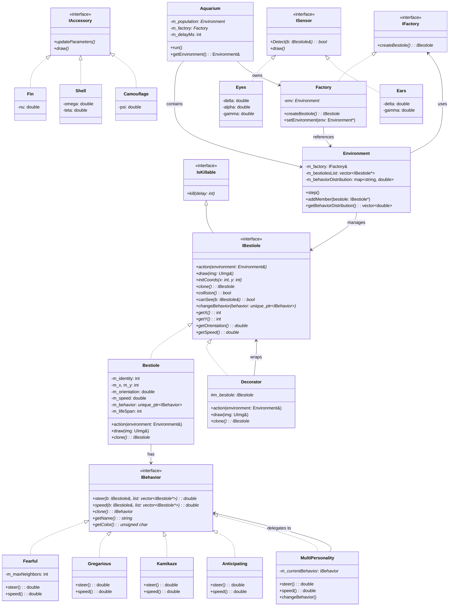
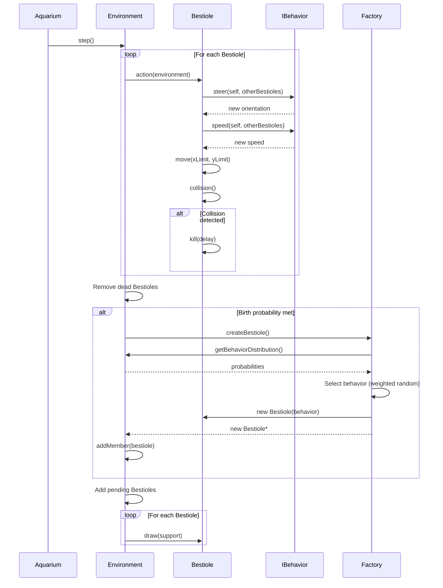
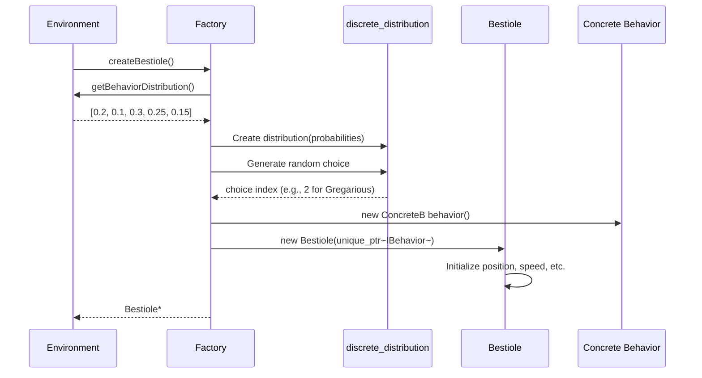

# Bestioles Ecosystem Simulation

A C++ simulation of a virtual 2D ecosystem inhabited by "Bestioles." This project demonstrates core object-oriented programming (OOP) principles and the application of design patterns to create complex, extensible, and emergent behaviors. The ecosystem is visualized in real-time using the CImg library.

## Features

* **Real-time Visualization:** The `Aquarium` class uses the CImg library to render the `Environment` and all `Bestioles` in real-time.
* **Dynamic Behaviors:** Bestioles' movement and actions are controlled by swappable behaviors (e.g., `Fearful`, `Gregarious`), implementing the **Strategy Pattern**.
* **Extensible Bestioles:** The **Decorator Pattern** is used to dynamically add accessories (`Fin`, `Shell`, `Camouflage`) and sensors (`Ears`, `Eyes`) to Bestioles.
* **Clean Creation:** The **Factory Pattern** is used to abstract the creation process of new `Bestiole` instances.

## Tech Stack

* **C++ (11 or newer)**
* **CImg:** Used for all 2D graphics and window management.
* **make:** For building the project.

## Building and Running

### Prerequisites

Before you begin, you will need:
* A C++ compiler (like `g++` or `clang++`)
* `make`
* X11 to display the simulation, which you would get like that on Debian:
    ```bash
    sudo apt-get install libx11-dev
    ```

### Steps

1.  **Clone the repository:**
    ```bash
    git clone https://github.com/AloisHasNeurons/BestiolesEcosystem.git
    cd BestiolesEcosystem
    ```

2.  **Build the project:**
    ```bash
    make
    ```

3.  **Run the simulation:**
    ```bash
    ./main
    ```

## Project Design

This project is built around key design patterns to ensure flexibility and separation of concerns.

### Strategy Pattern (Behaviors)

**Why this pattern?**
The Strategy Pattern was chosen to encapsulate the different movement and decision-making algorithms for Bestioles. This allows each Bestiole to have interchangeable behaviors without modifying its core implementation.

**How it's adapted:**
- The `IBehavior` interface defines two key methods: `steer()` for direction control and `speed()` for velocity management.
- Concrete behaviors (`Fearful`, `Gregarious`, `Kamikaze`, `Anticipating`, `MultiPersonality`) implement these methods with their own logic.
- Each Bestiole holds a `std::unique_ptr<IBehavior>`, allowing behaviors to be changed at runtime via `changeBehavior()`.
- Behaviors also define their own color representation, making visual distinction easy.
- The `MultiPersonality` behavior is a composite that switches between other behaviors periodically, demonstrating how strategies can be composed.

### Decorator Pattern (Accessories & Sensors)

**Why this pattern?**
The Decorator Pattern enables dynamic addition of capabilities (accessories and sensors) to Bestioles without subclassing. This keeps the class hierarchy flat while allowing rich combinations of features.

**How it's adapted:**
- The `Decorator` base class wraps an `IBestiole*` and delegates all interface calls to the wrapped object.
- Accessories (`Fin`, `Shell`, `Camouflage`) modify physical attributes like speed, resistance, and opacity.
- Sensors (`Eyes`, `Ears`) extend perception capabilities with different detection characteristics.
- Decorators can be stacked, allowing a Bestiole to have multiple accessories and sensors simultaneously.
- Each decorator overrides the `clone()` method to ensure proper deep copying of the entire decoration chain.

### Factory Pattern (Creation)

**Why this pattern?**
The Factory Pattern centralizes Bestiole creation logic, allowing the system to create diverse creatures based on configurable probability distributions without coupling the creation code to specific types.

**How it's adapted:**
- `IFactory` defines the creation interface with a single `createBestiole()` method.
- The `Factory` class accesses the `Environment` to retrieve behavior distribution probabilities.
- Using `std::discrete_distribution`, the factory performs weighted random selection of behavior types.
- The factory creates Bestioles with their initial behavior, abstracting creation details from the Environment.
- This design allows easy modification of population dynamics by adjusting distribution weights.

### Class Diagram



### Key Interactions (Sequence Diagrams)

#### Simulation Step

This diagram shows how a single simulation step is executed, demonstrating the interaction between the Aquarium, Environment, and Bestioles.



#### Bestiole Creation with Factory

This diagram illustrates how the Factory creates a new Bestiole with a randomly selected behavior.



## Project Structure
```
.
├── Makefile              # Build script
├── README.md             # Project documentation
├── docs/                 # Project documentation files
│   ├── BE.pdf
│   └── Grille_Evaluation_BE_bestioles.pdf
├── include/
│   ├── CImg.h            # CImg library header
│   ├── UImg.h            # Custom image utility header
│   ├── accessories/      # Concrete IAccessory implementations
│   │   ├── Camouflage.h
│   │   ├── Fin.h
│   │   └── Shell.h
│   ├── behaviors/        # Concrete IBehavior strategies
│   │   ├── Anticipating.h
│   │   ├── Fearful.h
│   │   ├── Gregarious.h
│   │   ├── Kamikaze.h
│   │   └── MultiPersonality.h
│   ├── core/             # Core simulation classes
│   │   ├── Aquarium.h
│   │   ├── Bestiole.h
│   │   └── Environment.h
│   ├── interfaces/       # Abstract interfaces
│   │   ├── IAccessory.h
│   │   ├── IBehavior.h
│   │   ├── IBestiole.h
│   │   ├── ISensor.h
│   │   └── IsKillable.h
│   ├── patterns/         # Design pattern base classes
│   │   ├── Decorateur.h
│   │   ├── Factory.h
│   │   └── IFactory.h
│   └── sensors/          # Concrete ISensor implementations
│       ├── Ears.h
│       └── Eyes.h
└── src/
    ├── behaviors/        # Behavior implementation files
    │   ├── Anticipating.cpp
    │   ├── Fearful.cpp
    │   ├── Gregarious.cpp
    │   ├── Kamikaze.cpp
    │   └── MultiPersonality.cpp
    ├── core/             # Core class implementation files
    │   ├── Aquarium.cpp
    │   ├── Bestiole.cpp
    │   └── Environment.cpp
    ├── main.cpp          # Main executable entry point
    └── patterns/         # Pattern implementation files
        └── Factory.cpp
```
