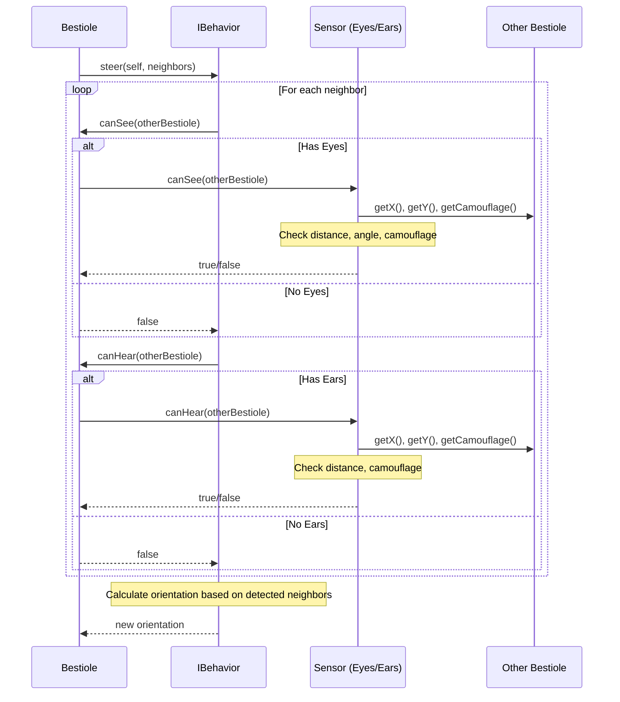

# Steering Process with Sensors

This diagram shows how the `steer` method uses sensors to detect neighbors.

```mermaid
sequenceDiagram
    participant B as Bestiole
    participant Bh as IBehavior
    participant S as Sensor (Eyes/Ears)
    participant OB as Other Bestiole

    B->>Bh: steer(self, neighbors)
    
    loop For each neighbor
        Bh->>B: canSee(otherBestiole)
        alt Has Eyes
            B->>S: canSee(otherBestiole)
            S->>OB: getX(), getY(), getCamouflage()
            Note over S: Check distance, angle, camouflage
            S-->>B: true/false
        else No Eyes
            B-->>Bh: false
        end
        
        Bh->>B: canHear(otherBestiole)
        alt Has Ears
            B->>S: canHear(otherBestiole)
            S->>OB: getX(), getY(), getCamouflage()
            Note over S: Check distance, camouflage
            S-->>B: true/false
        else No Ears
            B-->>Bh: false
        end
    end
    
    Note over Bh: Calculate orientation based on detected neighbors
    Bh-->>B: new orientation
```
