# Bestiole Action and Sensor Interaction

This diagram illustrates how the `action` method executes, showing the interaction between behaviors, the `steer` method, sensors, and the `canSee`/`canHear` methods.

```mermaid
sequenceDiagram
    participant E as Environment
    participant B as Bestiole
    participant Bh as IBehavior
    participant S as Sensor (Eyes/Ears)
    participant OB as Other Bestiole

    E->>B: action(environment, self)
    
    Note over B: Check and decrement lifespan
    alt Lifespan == 0
        B->>B: kill(0)
        E->>E: recordEvent("Natural death")
        Note over B: Skip remaining action
    end
    
    Note over B: Check clone probability
    alt Random < cloneRate
        B->>B: clone()
        B-->>E: New cloned Bestiole
        E->>E: addMember(newBestiole)
        E->>E: recordEvent("Clone created")
    end
    
    Note over B: Steering phase
    alt Direction change cooldown == 0
        B->>E: getBestiolesList()
        E-->>B: neighbors vector
        
        B->>Bh: steer(self, neighbors)
        
        Note over Bh: Behavior iterates through neighbors
        loop For each neighbor
            Bh->>B: canSee(otherBestiole)
            
            alt Bestiole has Eyes decorator
                B->>S: canSee(otherBestiole)
                S->>OB: getX(), getY()
                OB-->>S: position
                Note over S: Calculate distance
                alt Distance <= delta (seeing range)
                    S->>B: getOrientation()
                    B-->>S: orientation
                    Note over S: Calculate angle to target
                    alt Angle within field-of-view (alpha/2)
                        S->>OB: getCamouflage()
                        OB-->>S: psi (camouflage value)
                        alt gamma > psi
                            S-->>B: true (can see)
                        else gamma <= psi
                            S-->>B: false (camouflage successful)
                        end
                    else Outside field-of-view
                        S-->>B: false
                    end
                else Distance > delta
                    S-->>B: false
                end
            else No Eyes decorator
                B-->>Bh: false
            end
            
            Bh->>B: canHear(otherBestiole)
            
            alt Bestiole has Ears decorator
                B->>S: canHear(otherBestiole)
                S->>OB: getX(), getY()
                OB-->>S: position
                Note over S: Calculate distance
                alt Distance <= delta (hearing range)
                    S->>OB: getCamouflage()
                    OB-->>S: psi (camouflage value)
                    alt gamma > psi
                        S-->>B: true (can hear)
                    else gamma <= psi
                        S-->>B: false (camouflage successful)
                    end
                else Distance > delta
                    S-->>B: false
                end
            else No Ears decorator
                B-->>Bh: false
            end
        end
        
        Note over Bh: Calculate new orientation based on visible/audible neighbors
        Bh-->>B: new orientation
        B->>B: Set orientation
        
        alt Significant orientation change
            B->>B: Set direction change cooldown
        end
    else Cooldown > 0
        B->>B: Decrement cooldown
        Note over B: Skip steering this step
    end
    
    Note over B: Speed calculation phase
    B->>E: getBestiolesList()
    E-->>B: neighbors vector
    B->>Bh: speed(self, neighbors)
    Note over Bh: Similar sensor checks as steer
    Bh-->>B: new speed
    B->>B: Enforce speed limits (min/max)
    
    Note over B: Movement phase
    B->>B: move(width, height)
    Note over B: Apply speed factor from Fin/Shell decorators
    B->>B: Update position based on orientation and speed
    B->>B: Handle boundary collisions (bounce)
```

