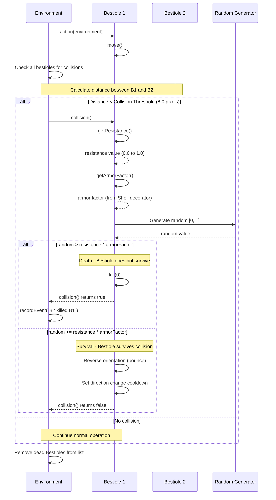

# Bestiole Collision

This diagram shows how collision detection works and how survival is determined based on the resistance attribute.

```mermaid
sequenceDiagram
    participant E as Environment
    participant B1 as Bestiole 1
    participant B2 as Bestiole 2
    participant RNG as Random Generator

    E->>B1: action(environment)
    B1->>B1: move()
    
    E->>E: Check all bestioles for collisions
    
    Note over E,B2: Calculate distance between B1 and B2
    
    alt Distance < Collision Threshold (8.0 pixels)
        E->>B1: collision()
        B1->>B1: getResistance()
        B1-->>B1: resistance value (0.0 to 1.0)
        B1->>B1: getArmorFactor()
        B1-->>B1: armor factor (from Shell decorator)
        
        B1->>RNG: Generate random [0, 1]
        RNG-->>B1: random value
        
        alt random > resistance * armorFactor
            Note over B1: Death - Bestiole does not survive
            B1->>B1: kill(0)
            B1-->>E: collision() returns true
            E->>E: recordEvent("B2 killed B1")
        else random <= resistance * armorFactor
            Note over B1: Survival - Bestiole survives collision
            B1->>B1: Reverse orientation (bounce)
            B1->>B1: Set direction change cooldown
            B1-->>E: collision() returns false
        end
    else No collision
        Note over E,B1: Continue normal operation
    end
    
    E->>E: Remove dead Bestioles from list
```
