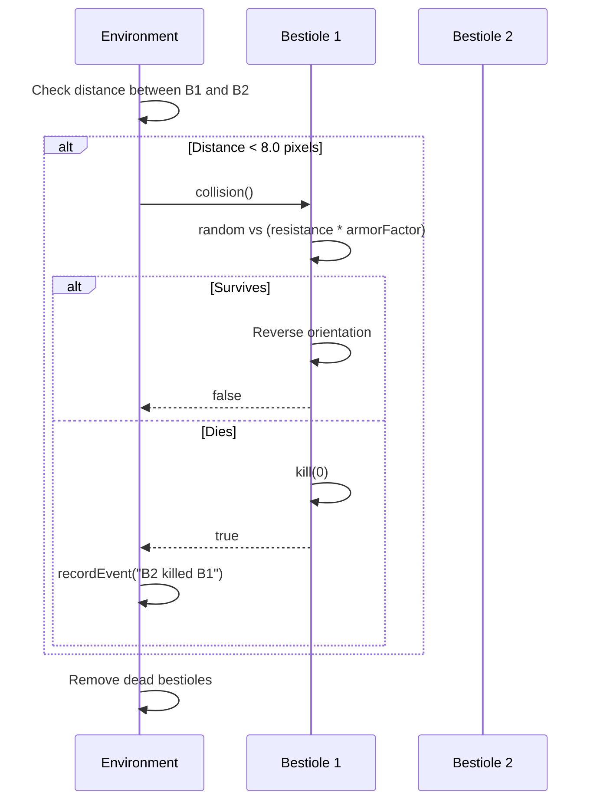

# Bestiole Collision

This diagram shows collision detection and survival determination.

```mermaid
sequenceDiagram
    participant E as Environment
    participant B1 as Bestiole 1
    participant B2 as Bestiole 2

    E->>E: Check distance between B1 and B2
    
    alt Distance < 8.0 pixels
        E->>B1: collision()
        B1->>B1: random vs (resistance * armorFactor)
        
        alt Survives
            B1->>B1: Reverse orientation
            B1-->>E: false
        else Dies
            B1->>B1: kill(0)
            B1-->>E: true
            E->>E: recordEvent("B2 killed B1")
        end
    end
    
    E->>E: Remove dead bestioles
```
