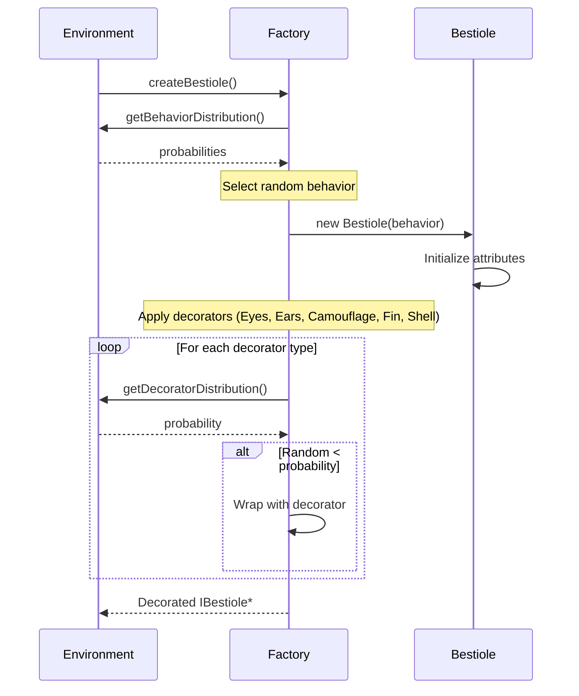

# Bestiole Creation with Factory

This diagram shows how the Factory creates a Bestiole with behavior and decorators.

```mermaid
sequenceDiagram
    participant E as Environment
    participant F as Factory
    participant B as Bestiole

    E->>F: createBestiole()
    F->>E: getBehaviorDistribution()
    E-->>F: probabilities
    
    Note over F: Select random behavior
    F->>B: new Bestiole(behavior)
    B->>B: Initialize attributes
    
    Note over F: Apply decorators (Eyes, Ears, Camouflage, Fin, Shell)
    loop For each decorator type
        F->>E: getDecoratorDistribution()
        E-->>F: probability
        alt Random < probability
            F->>F: Wrap with decorator
        end
    end
    
    F-->>E: Decorated IBestiole*
```
