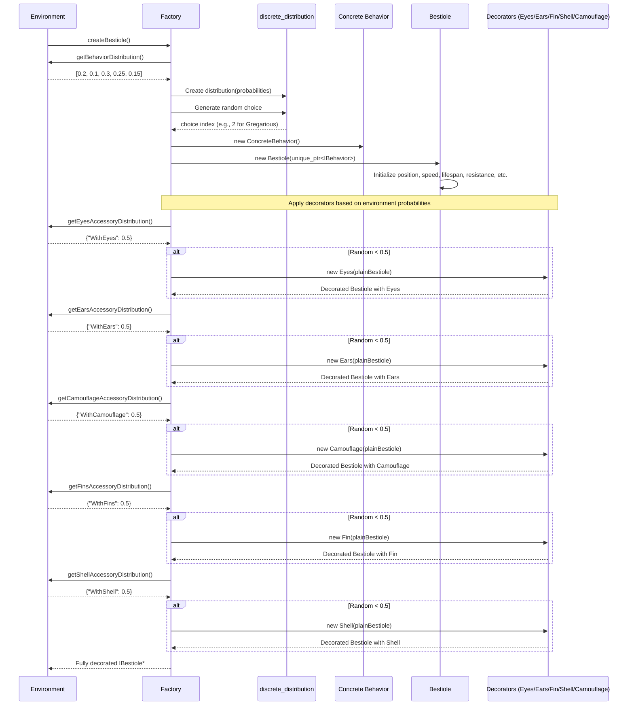

# Bestiole Creation with Factory

This diagram illustrates how the Factory creates a new Bestiole with a randomly selected behavior and decorators.

```mermaid
sequenceDiagram
    participant E as Environment
    participant F as Factory
    participant D as discrete_distribution
    participant Bh as Concrete Behavior
    participant B as Bestiole
    participant Dec as Decorators (Eyes/Ears/Fin/Shell/Camouflage)

    E->>F: createBestiole()
    F->>E: getBehaviorDistribution()
    E-->>F: [0.2, 0.1, 0.3, 0.25, 0.15]
    
    F->>D: Create distribution(probabilities)
    F->>D: Generate random choice
    D-->>F: choice index (e.g., 2 for Gregarious)
    
    F->>Bh: new ConcreteBehavior()
    F->>B: new Bestiole(unique_ptr<IBehavior>)
    B->>B: Initialize position, speed, lifespan, resistance, etc.
    
    Note over F,Dec: Apply decorators based on environment probabilities
    
    F->>E: getEyesAccessoryDistribution()
    E-->>F: {"WithEyes": 0.5}
    alt Random < 0.5
        F->>Dec: new Eyes(plainBestiole)
        Dec-->>F: Decorated Bestiole with Eyes
    end
    
    F->>E: getEarsAccessoryDistribution()
    E-->>F: {"WithEars": 0.5}
    alt Random < 0.5
        F->>Dec: new Ears(plainBestiole)
        Dec-->>F: Decorated Bestiole with Ears
    end
    
    F->>E: getCamouflageAccessoryDistribution()
    E-->>F: {"WithCamouflage": 0.5}
    alt Random < 0.5
        F->>Dec: new Camouflage(plainBestiole)
        Dec-->>F: Decorated Bestiole with Camouflage
    end
    
    F->>E: getFinsAccessoryDistribution()
    E-->>F: {"WithFins": 0.5}
    alt Random < 0.5
        F->>Dec: new Fin(plainBestiole)
        Dec-->>F: Decorated Bestiole with Fin
    end
    
    F->>E: getShellAccessoryDistribution()
    E-->>F: {"WithShell": 0.5}
    alt Random < 0.5
        F->>Dec: new Shell(plainBestiole)
        Dec-->>F: Decorated Bestiole with Shell
    end
    
    F-->>E: Fully decorated IBestiole*
```
